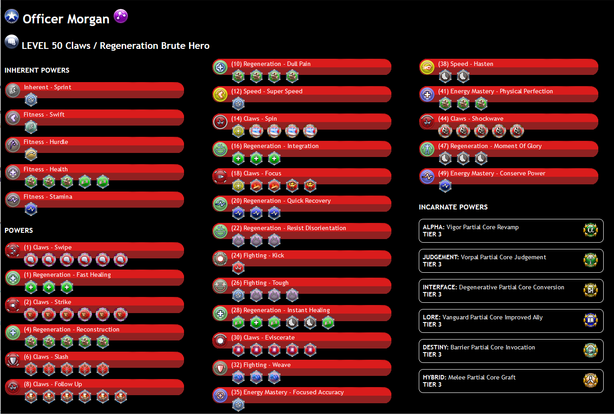

# cox-character-build
1. Make sure you have Java installed. At least version 11.0.3. More recent versions like 17 work fine

2. Build using: mvn package

3. Edit the properties.cfg file with your Rebirth Username , password and target location for the HTML files
   You may include the details for up to three accounts.

4. Open a command prompt in that folder.

5. Enter command: java -jar cox-character-build-0.0.1-jar-with-dependencies.jar

6. Wait a minute or two while the programme lists out all your characters.

7. Once it has ended, open the HTML folder and the index.html file

#Example Layout

